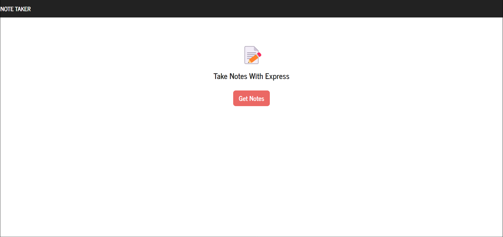

# Express.js Note Taker

## Description

A note taking application using Express.js on the back end and a json file to store data.

## Image

## 

## Task

```
This assignment modifies starter code and creates an application called 'Note Taker' that writes and saves notes. The 'Note Takers
app will use an Express.js back end and will save and retrieve note data from a JSON file.
```

## User Story

```
AS a small business owner
I WANT to be able to write and save notes
SO THAT I can organize my thoughts and keep track of tasks I need to complete
```

## Acceptance Criteria

## Instructions

## Acknowledgements and Credits

## License

MIT

## Author

Made with :blue_heart: by BluNite (Nkenge Crowe)
